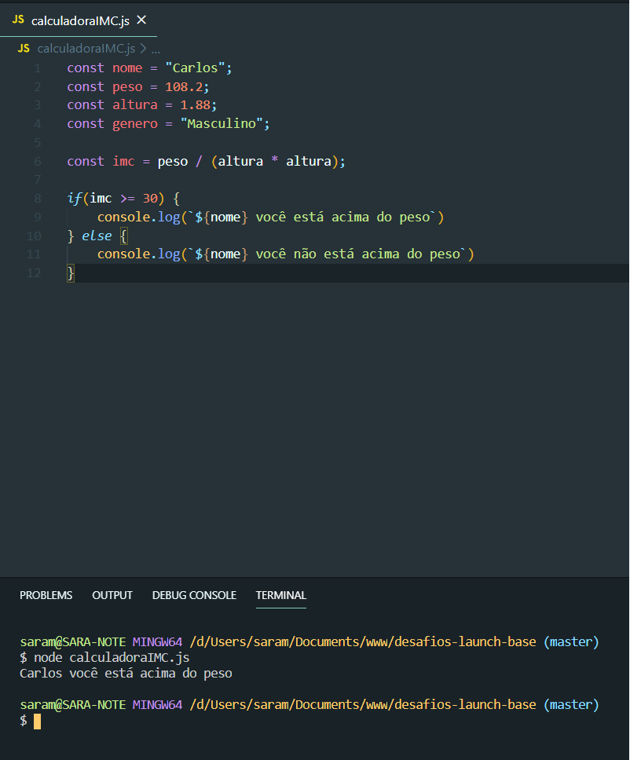
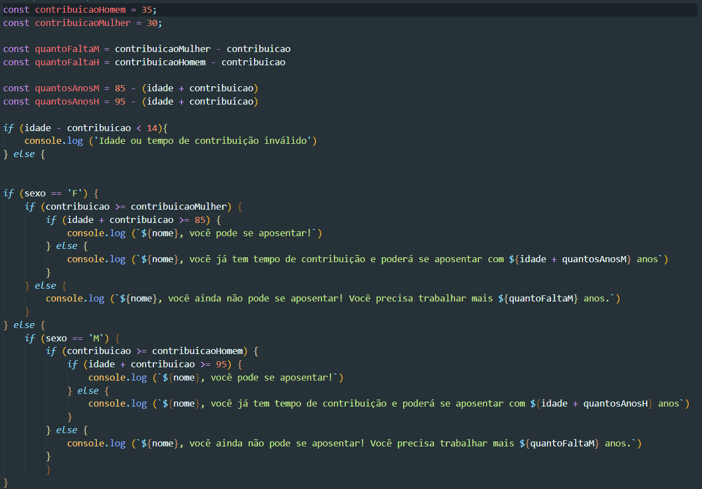
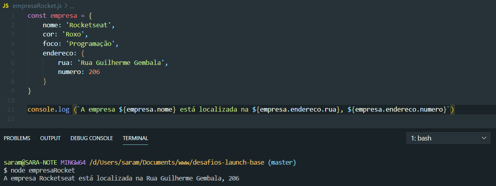
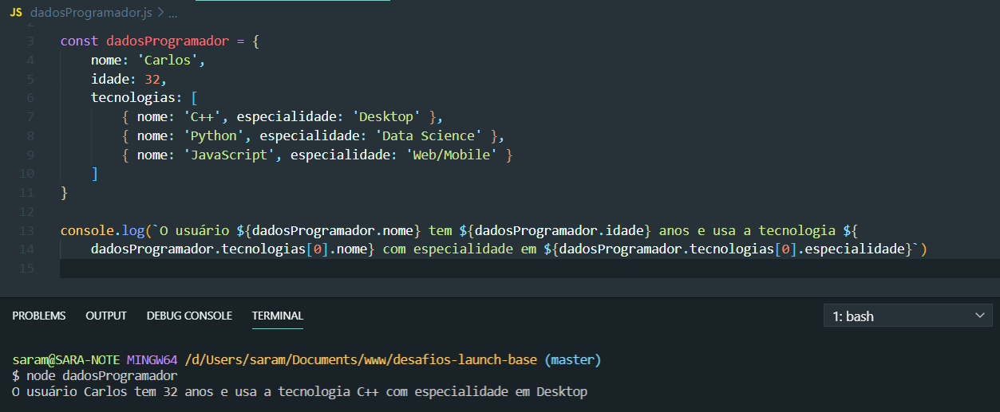

<h1 align="center">
    
</h1>

<h3 align="center">
  Desafio 1-1: Primeiros passos com JS
</h3>

<blockquote align="center">Primeiros desafios do Bootcamp Launch Base</blockquote>

  

## :rocket: Desafios 1-1

Conceitos abordados:

- **Variáveis**;
- **Condicionais**;
- **Operadores**.

### Cálculadora de IMC

Programa para calcular o IMC e nível de obesidade de uma pessoa.

Baseado no valor obtido através desse cálculo exibe as seguintes mensagens:

- `SE` o `IMC` maior ou igual a `30`: Carlos você está acima do peso;
- `SE` o `IMC` menor que `29.9`: Carlos você não está acima do peso;

    

      
    
 

### Calculadora de aposentadoria

Programa para calcular a aposentadoria de uma pessoa.

Calcula se a pessoa está apta ou não para se aposentar e no fim imprime uma mensagem em tela.

- O tempo de contribuição mínimo para **homens** é de **35 anos** e, para **mulheres**, **30 anos**;
- Utilizando a regra 85-95, a soma da idade com o tempo de contribuição do **homem** precisa ser de no mínimo 95 anos, enquanto a **mulher** precisa ter no mínimo 85 anos na soma;

Imprime na tela:

- `SE` a pessoa estiver aposentada;
- `SE` a pessoa NÃO estiver aposentada;

+ `SE` contribui pelo tempo certo mostra com quantos anos poderá se aposentar;
+ `SE` Atingiu a idade correta mostra quantos anos ainda precisa contribuir;

      

 

## :rocket: Desafios 1-2

Conceitos abordados:

- **Objetos**;
- **Vetores**.

### Construção e impressão de objetos

Programa que armazena dados da empresa Rocketseat dentro de um objeto chamado empresa. 

Imprime em tela utilizando console.log o nome da empresa e seu endereço:

      

 

### Vetores e objetos

Programa com um objeto para armazenar dados de um programador como nome, idade e tecnologias que trabalha.

As tecnologias também devem ser objetos contendo nome e especialidade.

Imprime em tela o nome e especialidade da primeira tecnologia que o usuário utiliza:

      

 

---

Made by [Sara Margarido](https://www.linkedin.com/in/saramargarido/)